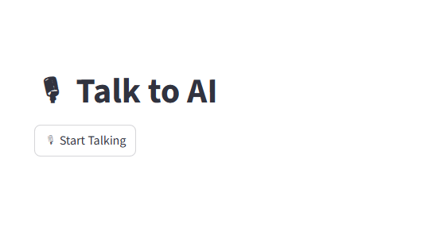
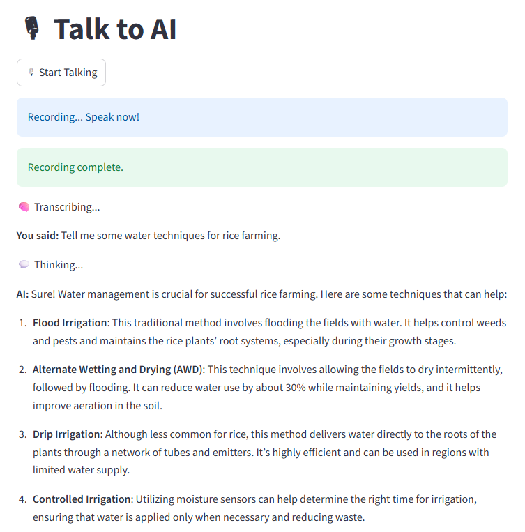
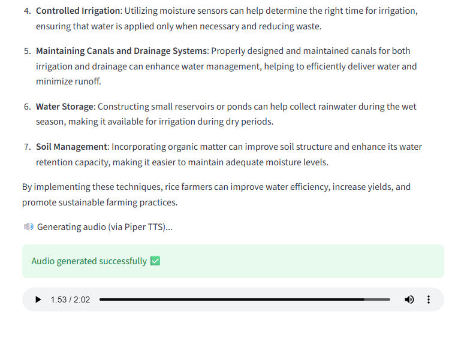

# Whisper_to_TTS_Setup

# 🎙️ Whisper → GPT → Piper TTS (Voice Assistant)

This project is a real-time speech assistant that:
1. Listens to your voice.
2. Transcribes it using **Whisper** (running locally or remotely).
3. Sends the transcript to **GPT-4o-mini** for a conversational response.
4. Converts the answer into speech using **Piper TTS**.

---

## 🚀 Prerequisites

Before running, ensure:
- You have **SSH access** to the remote TPU/VM where the Whisper and Piper servers are hosted.
- You have **Python 3.10+** and **Streamlit** installed locally.
- You’ve set up your **OpenAI API key**.

---

## 🔌 Step 1. Start Tunneling

You need to tunnel both **Whisper** (port 9000) and **Piper TTS** (port 5000) to your local machine.

### Example:

```bash
# Tunnel Piper TTS (Port 5000)
ssh -i <path-to-ssh-key> -L 5000:127.0.0.1:5000 <user-name>@<ip>

# Tunnel Whisper (Port 9000)
ssh -i <path-to-ssh-key> -L 9000:127.0.0.1:9000 <user-name>@<ip>
```

Example for reference:
```bash
ssh -i C:\Users\<private-key path> -L 5000:127.0.0.1:5000 <user-id>@<ip-address>
ssh -i C:\Users\<private-key path> -L 9000:127.0.0.1:9000 shantanu_tpu@35.186.40.29
```

Keep both terminals running while you use the app.

---

## ⚙️ Step 2. Setup Environment

Create a `.env` file inside the project directory:

```bash
OPENAI_API_KEY=<your-openai-api-key>

WHISPER_ENDPOINT=http://127.0.0.1:9000/transcribe
PIPER_TTS_API=http://127.0.0.1:5000/tts
```

---

## 🧩 Step 3. Install Dependencies on venv

```bash
python -m venv whisper_tts_env
whisper_tts_env\Scripts\activate
pip install -r requirements.txt
```

(or manually install the key packages:)

```bash
pip install streamlit sounddevice soundfile webrtcvad openai requests python-dotenv
```

---

## ▶️ Step 4. Run the Streamlit App

Navigate to the complete code folder:

```bash
cd COMPLETE_MODEL
streamlit run app.py
```
---



---

## 🗣️ Step 5. Usage

1. Click **“Start Talking”**
2. Speak for up to **10 seconds** (default duration).
3. Wait for transcription to appear on screen.
4. The AI will process your query and speak back using **Piper TTS**.
---

---
✅ You’ll see messages like:
- *Recording... Speak now!*
- *Thinking...*
- *Generating audio (via Piper TTS)…*
- *Audio generated successfully ✅*

Then you can **play the audio** directly in the UI.
---

---

## 🧠 Notes
- If you see an error like `Missing 'text'`, ensure the answer string isn’t empty before TTS conversion.
- Both Whisper and Piper must be running and reachable at the tunneled ports.
- The current model used is `gpt-4o-mini` (via OpenAI API).

---
